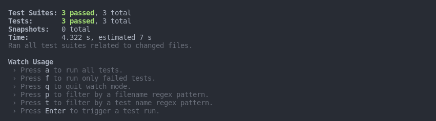

# Space Travellers' Hub

A Prrojest that works on a real live datafrom the SpaceX API. A web application that provides commercial and scientific space travel services.
The application allows users to book rockets and join selected space missions.

[Live Link](https://trusting-poitras-39fd6a.netlify.app/)




## Built With

- ReactJS
- Redux
- CSS
- Eslint, Stylelint

## Getting Started

To get a local copy up and running clone the repo and run

```
https://github.com/Whoistolu/Space-Traveler-Hub

```

### Install

`npm install`

### Usage

to serve the application on `localhost` run

`npm start`

## Authors1

👤 **Author1**

- Name: Ajise Toluwase
- GitHub: [@githubhandle](https://github.com/Whoistolu)
- Twitter: [@twitterhandle](https://twitter.com/Littletolu)
- LinkedIn: [LinkedIn](https://www.linkedin.com/in/toluwase-ajise-9b40411b2/)

👤 **Author2**

- GitHub: [@luqmanmusah](https://github.com/luqmanmusah)
- LinkedIn: [Luqman Musah](https://www.linkedin.com/in/luqman-musah/)

## 🤝 Contributing

Contributions, issues, and feature requests are welcome!

Feel free to check the [issues page](../../issues/).

## Show your support

Give a ⭐️ if you like this project!

